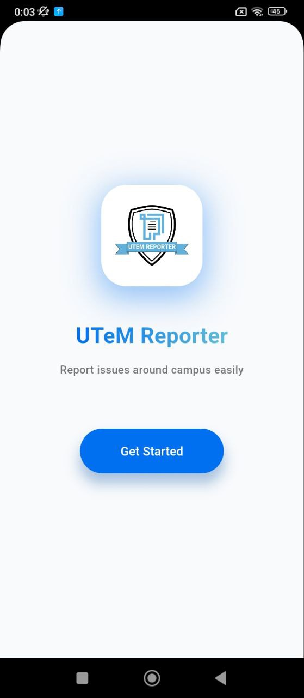
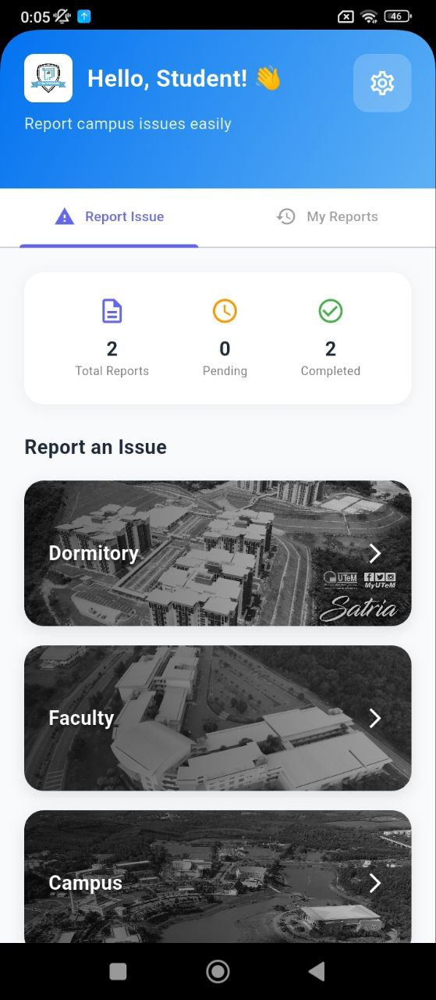
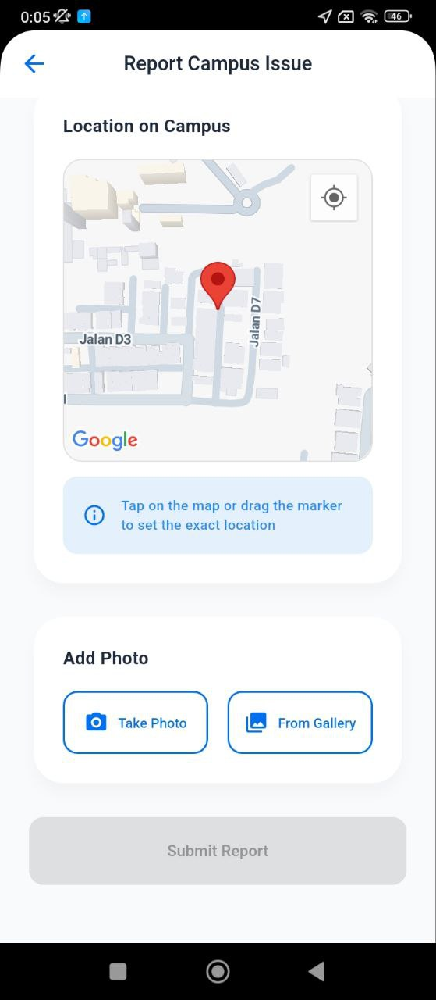
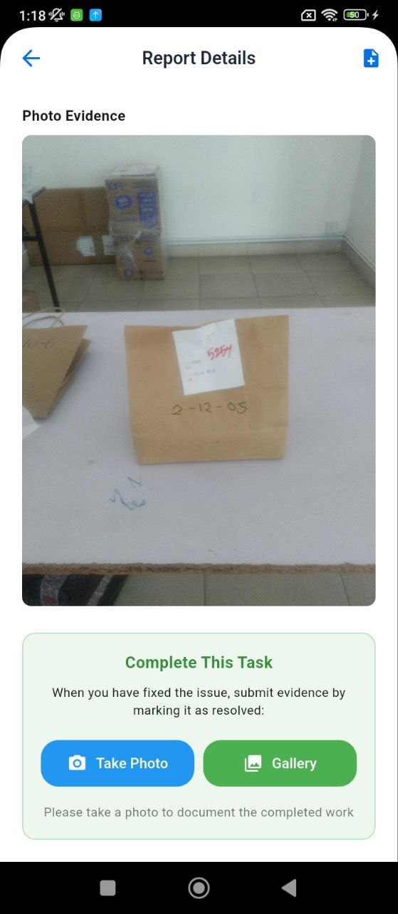

# UTeM Reporter

<p align="center">
  <!-- Replace 'logo.png' with your logo file when available -->
  
</p>

[](LICENSE)
[](https://github.com/irzazman/university-report-app/stargazers)

## Overview

**UTeM Reporter** is a cross-platform app designed to help students and staff quickly report issues around campus. With a user-friendly interface and integrated map/location features, keeping your campus in top shape has never been easier.

---

## Features

- 📱 Easy-to-use interface for reporting issues
- 📍 Map integration for precise location of campus problems
- 📸 Attach photos as evidence
- 📝 Track report status (pending, completed)
- 🔔 Notifications and updates for your reports
- 🎯 Designed for students, staff, and campus administration

---

## Screenshots

<p align="center">




</p>

---

## Getting Started

### Prerequisites

- [Flutter](https://docs.flutter.dev/get-started/install) (v3.114.0) (Recommended) 
- Dart SDK

### Installation

1. **Clone this repository**
    ```bash
    git clone https://github.com/irzazman/university-report-app.git
    cd university-report-app
    ```

2. **Install dependencies**
    ```bash
    flutter pub get
    ```

3. **Run the app**
    ```bash
    flutter run
    ```

---

## Usage

1. Launch the app on your device.
2. Tap "Get Started" to begin reporting campus issues.
3. Log in into the system.
4. Select report category (Dormitory, Faculty, Campus, etc.).
5. Pinpoint the issue location on the map.
6. Add a photo and description.
7. Submit your report and track its status.

---

## License

Distributed under the MIT License. See [LICENSE](LICENSE) for more information.

---

## Contact

For questions or suggestions, open an issue or contact [@irzazman](https://github.com/irzazman).

---

<sub>Made with ❤️ for the UTeM community.</sub>